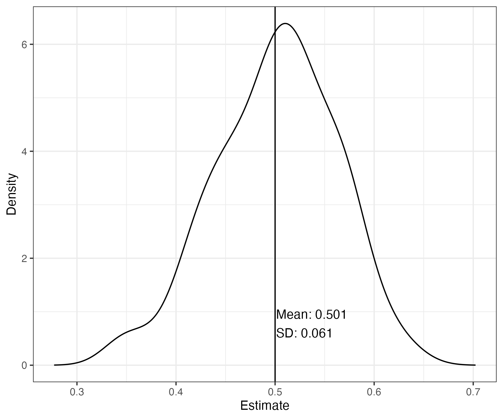
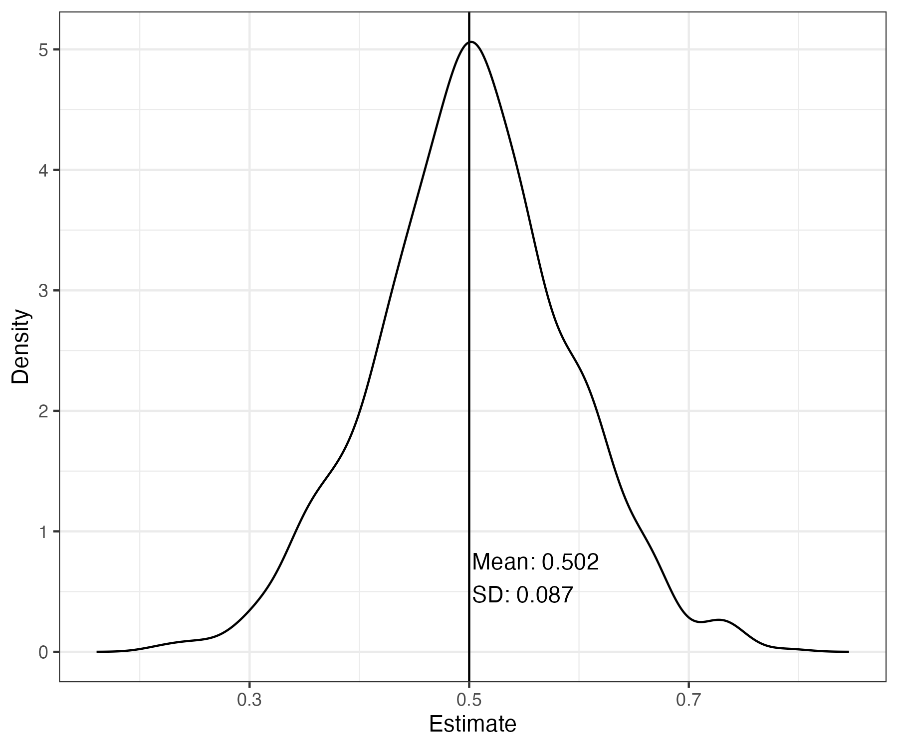

```{r setup, include=FALSE}
library(learnr)
knitr::opts_chunk$set(echo = FALSE)

# load packages
library(learnr)
library(gradethis)
library(sortable)
library(tidyverse)
library(learnrhash) #devtools::install_github("rundel/learnrhash")
library(showtext)
library(googlesheets4)
library(mcreplicate)
library(knitr)
library(hrbrthemes)
library(here)
library(lme4)
library(progressr)
library(janitor)
library(future)
library(fixest)
library(broom)
lag <- dplyr::lag
#devtools::install_github("graveja0/HPOL8539PKG")
#library(HPOL8539PKG)
# devtools::load_all("../../HPOL8539PKG")


# don't echo chunks
knitr::opts_chunk$set(echo = FALSE)

# apply theme to ggplot
ggplot2::theme_set(theme_bw())

map_multicore <- function(.x, .f, ..., .id = NULL) {
  .f <- purrr::as_mapper(.f, ...)
  p <- progressor(steps = length(.x))
  f <- function(...) {
    p()
    .f(...)
  }
  furrr::future_map(.x, f, ..., .id = .id)
}

plot_sampling_distribution <- function(x,truth) {
  d <- density(x)
  p_df <- as_tibble(cbind(x = d$x, density = d$y))
  p_df %>%
    ggplot(aes(x = x, y = density)) + geom_line() +
    #hrbrthemes::theme_ipsum() +
    labs(x = "Estimate", y = "Density") +
    geom_vline(aes(xintercept = truth)) +
    annotate("text",x = mean(x), y = min(d$y*1.2), vjust=-1,label  = glue::glue("  \tMean: {formatC(mean(x),digits = 3, format='f')}\n   SD: {formatC(sd(x),digits = 3, format = 'f')}"), hjust = 0)
}

plot_cis <- function(x, K, truth) {
  res <- x %>% bind_rows(.id = "m") %>%
    as_tibble() %>%
    mutate(m = factor(m)) %>%
    mutate(m = fct_reorder(m,estimate, .desc = TRUE)) %>%
    mutate(truth = truth) %>%
    rowwise() %>%
    mutate(covered = as.integer(between(truth,conf.low,conf.high))) %>%
    ungroup() %>%
    mutate(color = ifelse(covered ==1 , "","Rejected"))
  
  K = sample(res$m,100, replace =TRUE)
  res %>%
    filter(m %in% K) %>%
    ggplot() +
    geom_errorbar(aes(xmin =  conf.low, xmax = conf.high, y= m,colour = color)) +
    #theme_ipsum() +
    scale_y_discrete(breaks = NULL) +
    geom_vline(aes(xintercept = truth)) +
    labs(title= glue("Confidence Intervals for {prettyNum(length(K),big.mark=',')} of {prettyNum(length(res$m),big.mark=',')} Estimates"),
         y= "Sampling Iteration",x = "Estimate",
         subtitle= glue("{formatC(100*mean(res$covered),digits = 1, format='f')}% of confidence intervals cover the truth")) +
    scale_colour_manual(values = c("black","red")) +
    theme(legend.position = "none")
}

options("scipen" = 100, "digits" = 5)

#knitr::purl(here("Panel Data Methods I/Panel Data Methods I.Rmd"))
```


## Motivation 

Our objective today is to extend our consideration of a data generation process (DGP) with unobserved heterogeneity.

Recall the basic DGP we introduced last week:

$$
Y_i = \mathbf{X}_i'\beta + \tau D_i + \epsilon_i  \quad \quad \quad Eq. 1
$$
where $i$ indexes indiviudal units, $\mathbf{X}_i$ is a vector of unit-level attributes, and $D_i$ is a binary treatment indicator. Our parameter of interest is $\tau$. 

Recall that with this DGP defined, we defined a full set of parameters as the "ground" truth, and then simulated $M=1,000$ separate datasets, each time running a linear regression model. We extracted the $\hat \tau$ estimate from each regression, and then plotted their distribution. 

These parameter values, as well as the plotted sampling distribution, are shown below. 

```{r}
#| echo: false
#| exercise: false
#| eval: true

params =list(
  N = 1000,
  mean_x_i = 2,
  sd_x_i = 0.5,
  beta = 1,
  tau = 0.5,
  sigma_sq_epsilon = 1
)

params %>% data.frame() %>% gather(param,value) %>% kable(caption = "Parameter Values (Eq. 1)")
```

```{r basic}
#| echo: false
#| exercise: false
#| eval: false

##################################
# Step 1: Parameterize the Problem
##################################
params =list(
  N = 1000,
  mean_x_i = 2,
  sd_x_i = 0.5,
  beta = 1,
  tau = 0.5,
  sigma_sq_epsilon = 1
)

####################################################
# Step 2: Define a Data Generation Process Function
#####################################################
dgp_df_u =function(params) {
  with(params,{
    df =
      tibble(
        # Covariate
        x_i = rnorm(N, mean_x_i, sd_x_i),
        # ADD UNOBSERVED HETEROGENEITY TERM
        u_i = rnorm(N, mean = 0, sd = 1)) %>% 
        # Induce correlation between u_i and treatment;
        # higher values of u_i make it more likely you're treated. 
        rowwise() %>% # This allows us to get each value's pr_treated in the line below. 
        mutate(pr_treated = boot::inv.logit(u_i)) %>% 
        ungroup() %>%  # This undoes the rowwise 
        # Treatment indicator
        mutate(d_i = rbinom(N, size = 1, prob = pr_treated)) %>% 
        mutate(epsilon_i = rnorm(N, mean = 0, sd = sigma_sq_epsilon)) %>% 
        # u_i is also in the DGP for y_i 
        #mutate(y_i = beta * x_i + tau * d_i + u_i + epsilon_i) %>% 
        mutate(y_i = beta * x_i + tau * d_i  + epsilon_i) %>% 
        # because u_i is unobserved, we strip it from the "observed" data output. 
        select(-u_i)
    return(df)
  })
}

############################################
# 3. Define and Apply an Estimation Function
#############################################
estimator_fn = function(df) {
  out =
    df %>% 
      lm(y_i ~ x_i + d_i, data = .)
  return(out)
}

########################################
# 4. Define the discriminator function 
# (For this exercise we want to extract tau-hat 
# i.e., the coefficient on treated)
########################################
disc_fn = function(fit) {
  fit_ =broom::tidy(fit)   # This cleans up the fitted regression object
  out =fit_ %>% 
    filter(term=="d_i") %>% 
    pull(estimate)
  
  return(out)
}

###############################################
# 5. Define a compound function that executes
# steps 1-4 based on the parameter inputs. 
###############################################

generate_estimate_discriminate <- function(params) {
  params %>% # Step 1: Parameterize the problem
      dgp_df_u() %>%  # Step 2: Define the data generation process
        estimator_fn() %>%  # Step 3: Estimate 
          disc_fn() %>% # Step 4: Pull out what you need
            data.frame(tau_hat = .) # store the result as a data frame object
}

# Monte Carlo simulation based on 100 different realizations of the DGP:
M = 100
set.seed(123)
mc_result <- 1:M %>% map_df(~generate_estimate_discriminate(params))

plot_sampling_distribution(mc_result$tau_hat, truth = params$tau)
ggsave(here::here("Panel Data Methods I/images/samp-dist-noUi.png"),width=6,height=5)


```

```{r,out.width="50%", echo = FALSE, fig.align="center",fig.cap="Sampling Distribution of OLS Estimator of tau"}

```

## Exercise 1: Unobserved Heterogeneity

Note that this exercise repeats Exercise 4 from last week's session. 

We will next adapt the underlying DGP to include an unobserved heterogeneity term $U_i$:

$$
Y_i = \mathbf{X}_i'\beta + \tau D_i + U_i +\epsilon_i \quad \quad \quad Eq. 2
$$
Recall the basic four-step process we will go through:

```{r}
#| echo: true
#| eval: false

params %>% 
  generate_data() %>% 
    estimate() %>% 
      discriminate()

do_it_all <- function(params) {
  params %>% 
    generate_data() %>% 
      estimate() %>% 
        discriminate()
}

```


```{r ovb1}
#| echo: true
#| exercise: true
#| exercise.lines: 60

##################################
# Step 1: Parameterize the Problem
##################################
params =list(
  N = 1000,
  mean_x_i = 2,
  sd_x_i = 0.5,
  beta = 1,
  tau = 0.5,
  sigma_sq_epsilon = 1
)

####################################################
# Step 2: Define a Data Generation Process Function
#####################################################
dgp_df_u =function(params) {
  with(params,{
    df =
      tibble(
        # Covariate
        x_i = rnorm(N, mean_x_i, sd_x_i),
        # ADD UNOBSERVED HETEROGENEITY TERM
        u_i = rnorm(N, mean = 0, sd = 1)) %>% 
        # Induce correlation between u_i and treatment;
        # higher values of u_i make it more likely you're treated. 
        rowwise() %>% # This allows us to get each value's pr_treated in the line below. 
        mutate(pr_treated = boot::inv.logit(u_i)) %>% 
        ungroup() %>%  # This undoes the rowwise 
        # Treatment indicator
        mutate(d_i = rbinom(N, size = 1, prob = pr_treated)) %>% 
        mutate(epsilon_i = rnorm(N, mean = 0, sd = sigma_sq_epsilon)) %>% 
        # u_i is also in the DGP for y_i 
        mutate(y_i = beta * x_i + tau * d_i + u_i + epsilon_i) %>% 
        # because u_i is unobserved, we strip it from the "observed" data output. 
        select(-u_i)
    return(df)
  })
}

############################################
# 3. Define and Apply an Estimation Function
#############################################
estimator_fn = function(df) {
  out =
    df %>% 
      lm(y_i ~ x_i + d_i, data = .)
  return(out)
}

########################################
# 4. Define the discriminator function 
# (For this exercise we want to extract tau-hat 
# i.e., the coefficient on treated)
########################################
disc_fn = function(fit) {
  fit_ =broom::tidy(fit)   # This cleans up the fitted regression object
  out =fit_ %>% 
    filter(term=="d_i") %>% 
    pull(estimate)
  
  return(out)
}

###############################################
# 5. Define a compound function that executes
# steps 1-4 based on the parameter inputs. 
###############################################

generate_estimate_discriminate <- function(params) {
  params %>% # Step 1: Parameterize the problem
      dgp_df_u() %>%  # Step 2: Define the data generation process
        estimator_fn() %>%  # Step 3: Estimate 
          disc_fn() %>% # Step 4: Pull out what you need
            data.frame(tau_hat = .) # store the result as a data frame object
}


```

Our next step is to repeat this process lots of times via a Monte Carlo simulation. We'll keep the number of Monte Carlo runs small (1000) to speed up computation, but note that in practice we may need to do this thousands of times. 

```{r mc_ovb, exercise.setup = "ovb1"}
#| echo: true
#| exercise: true
#| exercise.lines: 15


# Monte Carlo simulation based on 100 different realizations of the DGP:
M = 100
result_lm <- 1:M %>% map_df(~generate_estimate_discriminate(params))

plot_sampling_distribution(result_lm$tau_hat, truth = params$tau)
```

As we can see in the plot of the sampling distribution, our estimates are biased due to the omitted factor ($u_i$) that is correlated with treatment and the outcome. 

## Panel Data 

As you read about for today, analyzing panel data opens up new ways to estimate in such a way as to account for time-invariant unobserved heterogeneity in the data generation process. 

Our basic pivot is to move from a cross-sectional setting into a panel setting. In terms of the data generation process, that often means we will observe each unit ($i$) in our data at different points in time ($t$).^[Note, that for the following examples, $i$ will represent individual units and $t$ will represent a time dimension. However, panel data could take any number of forms, such as students ($i$) within classrooms or schools ($t$), patients ($i$) treated at the same hospital ($t$). We can also think of panel data at some higher level of aggregation than our unit of observation (e.g., individuals $i$ within states $g$ over time $t$.)
]

Let's also suppose that when we move to the panel data setting, we are at risk of an additional (time-related) dimension of unobserved heterogeneity in our outcomes. 

Our DGP thus becomes:

$$
Y_{it} = \mathbf{X}_{it}'\beta + \tau D_{it} + \color{red}{U} + \epsilon_{it}
$$
By moving to a panel data setting, we collect *repeated* observations on each unit $i$ in our population. These repeated observations are now indexed by $t$. 

Also note that our unobserved heterogeneity term is now defined as  $\color{red}{U = \delta_i + \gamma_t}$, which captures both unit-specific heterogeneity ($\delta_i$) and time-specific heterogeneity ($\gamma_t$). 

### Partitioning the DGP Into Systematic and Stochastic Components

Before we move on it is useful also to highlight two components of our underlying DGP: a **systematic** component and a **stochastic** component.^[A nice source on this topic can be found [here](https://gking.harvard.edu/files/making.pdf)] The stochastic component is given by

$$
\begin{equation}
Y_i \sim f(\color{blue}{\theta},\color{orange}{\epsilon_i})
\end{equation}
$$

and the systematic component is given by:

$$
\color{blue}{\theta} = g(\color{blue}{\beta , \tau, X_i,D_i})
$$

The above equations are generalized to accommodate any number of outcome types (e.g., continuous, binary, categorical). Cast in terms of a linear model, as we have specified above, we have

$$
Y_i \sim N(\color{blue}{\mu},\color{orange}{\sigma_{\epsilon}^2}), \quad \mu = g(\color{blue}{\beta , \tau, X_i,D_i}) = \color{blue}{\mathbf{X_i}'\beta + \tau D_i }
$$

Note that in the above equations, the systematic component is specified in $\color{blue}{\text{blue}}$ and the stochastic component in $\color{orange}{\text{orange}}$. 

Intuitively, the systematic component tells us about the level of of the outcome for individuals with the same value of $\mathbf{X_i}$ and $D_i$; outcomes for these individuals will be different, however, due to the stochastic (error term) component governed by $\sigma_{\epsilon}^2$.

We'll now turn back to the case with unobserved heterogeneity, which is shown in $\color{red}{\text{red}}$

$$
Y_{it} = \mathbf{X}_{it}'\beta + \tau D_{it} + \color{red}{U} + \epsilon_{it}
$$

As we will see below, how we deal with unobserved heterogeneity will hinge on whether we absorb $\color{red}{U}$ within the  $\color{blue}{\text{systematic}}$ or $\color{orange}{\text{stochastic}}$ component of the DGP. 

## Exercise II: Panel Data

Let's now augment our DGP to include this panel data component. We will assume we observe individual units both pre- and post the treatment time. Let's assume for now that we observe each unit once before the intervention time, and once after, so that the total number of time periods is 2 (i.e., $T=2$) and the treatment time (`tx_time`) occurs at $t=2$. 

```{r dgp_panel_setup}
#| echo: true
#| exercise: true
#| exercise.lines: 45

params_panel <- list(
  N = 1000,
  T = 2,
  tx_time = 2, 
  rho_t = 0.8,
  beta_0 = 0.5,
  beta_1 = 2,
  tau = 0.5,
  p_d = 0.5
)

dgp_panel <- function(params) {
  with(params, {

    # Time effects
    t_ <-
      data.frame(t = 1:T,
                 gamma_t = arima.sim(n=T, list(ar = rho_t, order=c(1,0,0))) %>% as.vector())

    # Individual measures and effects
    i_ <-
      data.frame(
        unit_id = 1:N,
        x_i = rnorm(N, mean = 0, sd = 1),
        u_i = rnorm(N, mean = 0, sd = 1)) %>%
      rowwise() %>% # This allows us to get each value's pr_treated in the line below. 
      mutate(pr_treated = boot::inv.logit(u_i)) %>% 
      ungroup() %>%  # This undoes the rowwise 
      # Treatment indicator
      mutate(d_i = rbinom(N, size = 1, prob = pr_treated)) %>% 
      ungroup()

    crossing(unit_id = i_$unit_id,t = t_$t) %>%
      left_join(i_,"unit_id") %>%
      left_join(t_,"t") %>%
      mutate(d_i = ifelse(t<tx_time,0,d_i)) %>%
      mutate(y_i = beta_0 + beta_1 * x_i + tau * d_i + u_i + gamma_t + rnorm(N, mean = 0, sd = 1))
  })
}

params_panel %>% 
  dgp_panel()

```

Consistent with the DGP, notice in the output that each individual unit is observed twice. 

## Exercise 3: Pooled OLS

We will first consider the case where we simply fit an ordinary least squares (OLS) regression to our (simulated) panel data. Essentially, we allow the unobserved heterogeneity terms to stay in the eror term:

$$
\begin{aligned}
Y_{it} &=\color{blue}{\mathbf{X}_{it}'\beta + \tau D_{it}} + \color{orange}{U} + \color{orange}{\epsilon_{it}} \\
Y_{it} &=\color{blue}{\mathbf{X}_{it}'\beta + \tau D_{it}} + \overbrace{\color{orange}{\delta_i} + \color{orange}{\gamma_t} + \color{orange}{\epsilon_{it}}}^{\color{orange}{\eta_{it}}} \\
&= \color{blue}{\mathbf{X}_{it}'\beta + \tau D_{it}}  + \color{orange}{\eta_{it}} \quad \quad \quad Eq. 3
\end{aligned}
$$
Thus, our estimation function is: 

```{r pooledOLS1, exercise.setup="dgp_panel_setup"}
#| echo: true
#| exercise: true
#| exercise-setup: simple1_dgp
#| exercise.lines: 9

estimator_fn_pols <- function(df) {
  lm(y_i ~ x_i + d_i, data = df)
}

params_panel %>% 
  dgp_panel() %>% 
    estimator_fn_pols()

```

Recall that in the DGP defined above, we have induced correlation between unobserved (unit-level) heterogeneity and the treatment indicator ($D_i$). We did so by setting the probability of treatment for each individual as a function (inverse logit) of $U_i$, (i.e., `pr_treated = inv.logit(u_i)`).

In addition,  unit- and time-level heterogeneity also enters the formula for our outcome $Y_i$,

$$
Y_{it} = \color{blue}{\mathbf{X}_{it}'\beta} + \color{blue}{\tau D_{it}} + \color{orange}{\delta_i} + \color{orange}{\gamma_t} + \color{orange}{\epsilon_{it}}
$$

Therefore, if we simulate and construct a sampling distribution for the POLS estimator for $\tau$, we will obtain inconsistent estimates:

```{r pooledOLS2, exercise.setup="pooledOLS1"}
#| echo: true
#| exercise: true
#| exercise-setup: simple1_dgp
#| exercise.lines: 22

# Define a discrimination function for the POLS estimator 
disc_fn_pols = function(fit) {
  fit_ =broom::tidy(fit)   
  out =fit_ %>% 
    filter(term=="d_i") %>% 
    pull(estimate)
  return(out)
}

generate_estimate_discriminate_pols <- function(params) {
  params %>% # Step 1: Parameterize the problem
      dgp_panel() %>%  # Step 2: DGP
        estimator_fn_pols() %>%  # Step 3: Estimate 
          disc_fn_pols() %>% # Step 4: Coefficient of interest
            data.frame(tau_hat = .) # Store as data fram
}

M = 100
result_pols <- 1:M %>% map_df(~generate_estimate_discriminate_pols(params_panel))
plot_sampling_distribution(result_pols$tau_hat, truth = params_panel$tau)
```

### Aside: A Note on Inference

Another issue we will run across with pooled OLS and panel data is known as "pseudo-replication." This is the idea that, with panel data, there is often correlation in $Y_i$ within units and across time.  Depending on the degree of correlation, we don't want to act is if we have $N*T$ rows of independent data; we may have an *effective* sample size closer to $N$.^[These types of considerations are a key motivation for the use of random effects and hierarchical modeling more generally---you can take entire courses on this, so I will only tease it here.] Therefore, we have to adjust our standard errors to account for the repeated measures in our data. 

More generally, we will continue to focus on parameter estimation for now, and cover issues related to statistical inference in a not-to-distant case study. 


```{r}
#| eval: false
#| echo: false
#| 
dgp_panel_randomizedD <- function(params) {
  with(params, {

    # Time effects
    t_ <-
      data.frame(t = 1:T,
                 gamma_t = rnorm(n=T))
                 #gamma_t = arima.sim(n=T, list(ar = rho_t, order=c(1,0,0))) %>% as.vector())

    # Individual measures and effects
    i_ <-
      data.frame(
        unit_id = 1:N,
        x_i = rnorm(N, mean = 0, sd = 1),
        u_i = rnorm(N, mean = 0, sd = 1)) %>%
      rowwise() %>% # This allows us to get each value's pr_treated in the line below. 
      mutate(pr_treated = 0.5) %>% 
      ungroup() %>%  # This undoes the rowwise 
      # Treatment indicator
      mutate(d_i = rbinom(N, size = 1, prob = pr_treated)) %>% 
      ungroup()

    crossing(unit_id = i_$unit_id,t = t_$t) %>%
      left_join(i_,"unit_id") %>%
      left_join(t_,"t") %>%
      mutate(d_i = ifelse(t<tx_time,0,d_i)) %>%
      mutate(y_i = beta_0 + beta_1 * x_i + tau * d_i + u_i + gamma_t + rnorm(N, mean = 0, sd = 1))
  })
}

generate_estimate_discriminate_pols_randomizedD <- function(params) {
  params %>% # Step 1: Parameterize the problem
      dgp_panel_randomizedD() %>%  # Step 2: Define the data generation process
        estimator_fn_pols() %>%  # Step 3: Estimate 
          disc_fn_pols() %>% # Step 4: Pull out what you need
            data.frame(tau_hat = .) # store the result as a data frame object
}

M = 100
result_pols_randomizedD <- 1:M %>% map_df(~generate_estimate_discriminate_pols_randomizedD(modifyList(params_panel,list(N=10000))))
plot_sampling_distribution(result_pols_randomizedD$tau_hat, truth = params_panel$tau)

```

## Exercise 4: Random Effects

In a random effects model, we assume that the unit- and time-specific effects (i.e., $\delta_i$ and $\gamma_i$, respectively) are random variables drawn from a distribution.^[Usually a normal distribution.] 

We keep these unobserved heterogeneity terms in the stochastic component of the model, and assume they are independent of $\epsilon_i$, and are thus uncorrelated with the systematic components (i.e., $X_i$ and $D_i$) in the DGP. 

These random effects have mean zero and standard deviation as follows:

$$
\begin{aligned}
\delta_i &\sim N(0,\sigma^2_i) \\
\gamma_t &\sim N(0,\sigma^2_t) 
\end{aligned}
$$
Note that we have now introduced two new parameters to our model: $\sigma^2_i$ and $\sigma^2_t$; these are parameters that will be estimated along with $\mathbf{\beta}$ and $\tau$ in our regression.^[A nice resource on random effects models can be found [here](https://link.springer.com/article/10.1007/s11135-014-0060-5) and [here](https://www.cambridge.org/core/journals/political-science-research-and-methods/article/explaining-fixed-effects-random-effects-modeling-of-timeseries-crosssectional-and-panel-data/0334A27557D15848549120FE8ECD8D63)]

In summary, and expressed in terms of our orignial DGP, we have,

$$
\begin{aligned}
Y_{it} &= \color{blue}{\mathbf{X}_{it}'\beta + \tau D_{it}} + \overbrace{\color{orange}{U}  + \color{orange}{\epsilon_{it}}}^{\color{orange}{v_{it}}} \\
 &= \color{blue}{\mathbf{X}_{it}'\beta + \tau D_{it}} + \color{orange}{v_{it}} \quad \quad \quad Eq. 4 \\
\color{orange}{v_{it}} &= \color{orange}{U} + \color{orange}{\epsilon_{it}} \\
 &= \color{orange}{\delta_i} + \color{orange}{\gamma_t}  +\color{orange}{\epsilon_{it}} \\
\delta_i &\sim N(0,\sigma^2_i) \\
\gamma_t &\sim N(0,\sigma^2_t) 
\end{aligned}
$$

### Random Effects: R Code

In R, a random effects model can be estimated using many packages. In the estimator function below, I will draw on the `lmer4` package.  

```{r re1, exercise.setup="dgp_panel_setup"}
#| echo: true
#| exercise: true
#| exercise.eval: false
#| eval: true
#| exercise.lines: 11


estimator_fn_re <- function(df) {
   lmer(y_i ~ x_i+ d_i + (1|unit_id) + (1|t), df)
}

params_panel %>% 
  dgp_panel() %>% 
    estimator_fn_re()

```


### Aside: "Fixed" and "Random" Effects

Notice in the output that there is a section called **Random effects** and a section called **Fixed effects**. The random effects results refer to the parameter estimates for the *stochastic* component of the model. That is, the  `Std.Dev.` estimates under the Random effects section results refer to the regression estimates of $\sigma^2_i$, $\sigma^2_t$ and $\sigma^2_{\epsilon}$, respectively. 

However, **the section titled "Fixed effects" does *NOT* provide estimates from a fixed effects regression.** This alternative use of the term "fixed effects" highlights an important difference in statistical terminology across fields. These estimates refer to a "fixed effect" as a statistician would call them, not as an econometrician would call them. 

I will briefly cover what a statistician often means when they use the term "fixed effects" below, and leave the econometric definition until later in this document. 


#### Fixed Effects: The Traditional Statistics Definition 

Suppose we were interested in evaluating the effect of a new dietary intervention administered through physicians offices. Let's index individual patients by $i$ and physicians by $k$. Assume, also, that we collect panel data on patients within physician offices where we follow patients over time ($t$). 

Our ultimate goal is to assess whether a change in some factor ($D_{it}$, the dietary change) affects the primary outcome $Y_{it}$. For our purposes here it does not matter whether $D_{it}$ is a continuous measure (e.g., number of calories) or a binary intervention (e.g., being assigned to a dietary coach). 

In this example, units in our data have attributes that we care about for the evaluation. For example, we have an inherent interest in the effect of treatment $D_{it}$, which varies among individuals. Since our primary interest is "fixed" on the effect of diet on outcomes, a statistician would call the effect estimate of $\hat \tau$ a "fixed effect" in the regression. 

There are other relevant attributes and sources of heterogeneity at play as well, however---and accounting for them is often important not only from a bias/consistency perspective, but also from a statistical inference perspective. 

For example, physicians in our sample likely differ in their level of (dietary habit) engagement with their patients. This may also matter for patient outcomes, and also possibly for whether or not a patient receives the intervention---so accounting for this source of physician-level heterogeneity may be important for all of the reasons why we are so focused on unobserved heterogeneity ($U$) across different units in our data. 

Physician-level attributes also matter because they are shared among patients who see the same doctor. That is, patients who share the same physician are likely exposed to similar if not identical levels of dietary engagement--so there may be correlation in our outcomes among patients in the same physician clinic. This raises the issue of "pseudo-replication" covered above, since not every observation in our data can be considered a new, "fresh" draw of independent information. 

A critical point, however, is that for our evaluation *we are not inherently interested in the effect of one physician vs. another on outcomes.* Thus, if the assumptions of random effects hold, we can safely relegate our accounting for this heterogeneity to the stochastic component of the model. By including these attributes as random effects, we take care of any issues related to unobserved heterogeneity *and* statistical issues that come up with possible pseudo-replication in our sample. 

### Random Effects: Sampling Distribution for Example

With all that out of the way, let's repeat our data generation and estimation process 100 times and look at the sampling distribution of $\hat \tau$ estimates:

```{r re2, exercise.setup="re1"}
#| echo: true
#| exercise: true
#| exercise-setup: simple1_dgp
#| exercise.lines: 31

# Define a discriminator function
disc_fn_re <- function(fit) {
  fit %>% summary() %>% pluck("coefficients") %>%
    data.frame() %>%
    rownames_to_column() %>%
    janitor::clean_names() %>%
    filter(rowname=="d_i") %>%
    pull(estimate) %>%
    as.vector()
}

# Bundle it all together in one function. 
generate_estimate_discriminate_re <- function(params) {
  suppressWarnings({
    suppressMessages({
      params %>% # Step 1: Parameterize the problem
        dgp_panel() %>%  # Step 2: Define the data generation process
          estimator_fn_re() %>%  # Step 3: Estimate 
            disc_fn_re() %>% # Step 4: Pull out what you need
              data.frame(tau_hat = .) # store the result as a data frame object
    })
  })
}

# Run it 100 times!
M = 100
result_re <- 1:M %>% map_df(~generate_estimate_discriminate_re(params_panel))

plot_sampling_distribution(result_re$tau_hat, truth = params_panel$tau)
```

As you can see in the sampling distribution, we end up with a distribution of estimates far from the truth. 

Why is this?  Recall, again, that a random effects model places assumptions on correlations between the random effects and the included regressors (i.e., $X_{it}$ and $D_{it}$. We specifically *assume* that the random effects **are not correlated** with either $X_{it}$ or $D_{it}$. But in our data generation function, we define the probability of treatment as a function of $u_i$. Specifically, it is defined as `pr_treated = inv_logit(delta_i)`. In addition to determining the probability of treatment, the unobserved heterogeneity terms also enter the DGP for the outcome $Y_{it}$:

$$
Y_{it} = \mathbf{X}_{it}'\beta + \tau D_{it} + \delta_i + \gamma_t + \epsilon_{it}
$$


We therefore have a situation in our DGP where the random effects, while *assumed* to be uncorrelated with the regressors (esp. $D_i$), actually is correlated with them. So the assumptions of random effects regression are not met for our DGP. 

All is not lost for random effects, however. We'll come back to random effects estimation later to recover ourselves when we fit a **correlated random effects regression.** But we'll first turn our attention to **fixed effects** regression from an econometric perspective. 

## Exercise 5: Dummy Variable Regression

Our first foray into fixed effect regression will consider dummy variable regression. The idea here is simple: rather than assume the unobserved heterogeneity terms can sit comfortably in the error term, we'll simply estimate a separate intercept for every unit and time period in our data: 

$$
\begin{aligned}
Y_{it} &= \underbrace{\color{blue}{\mathbf{X}_{it}'\beta} + \color{blue}{\tau D_i} + \color{blue}{\mathbf{\delta}_i} + \color{blue}{\mathbf{\gamma}_t}}_{\text{systematic component}}   + \color{orange}{\epsilon_{it}}
\end{aligned}
$$

Note how this differs from the random effects model  in that we have pulled the unobserved heterogeneity terms into the systematic component, whereas under the random effects approach we assumed these terms could remain in the  stochastic component:

$$
\begin{aligned}
Y_{it} &= \color{blue}{\mathbf{X}_{it}'\beta} + \color{blue}{\tau D_i} + \underbrace{\color{orange}{\mathbf{\delta}_i} + \color{orange}{\mathbf{\gamma}_t}  + \color{orange}{\epsilon_{it}}}_{\text{stochastic component}} 
\end{aligned}
$$
What is important about this change? First, by including the unobserved heterogeneity terms directly in the regression, our estimates of other parameters are conditioned on them; we thus control for any arbitrary correlation between the unobserved heterogeneity terms and the other regressors in our model. This is a big advantage of fixed effect approches over random effect approaches.^[Though, again, correlated random effects will address this issue too, as we'll see shortly.]

## Dummy Variable Regression: R Code

Let's go ahead and define an estimation function for dummy variable regression. In the code below, we simply include the `unit_id` and time (`t`) variables as factors in the regression model. When the regression runs, this amounts to creating a dummy variable for each unit in our data, and a dummy variable for each time period. **These unit- and time-specific effects are the econometric "fixed effects" in our regression.**

Go ahead an run a dummy variable fixed effect regression and take a look at the output. 

```{r dummy1, exercise.setup="dgp_panel_setup"}
#| echo: true
#| exercise: true
#| exercise.eval: false
#| exercise.lines: 15

estimator_fn_dummy <- function(df) {
  lm(y_i ~ d_i + factor(t) + factor(unit_id), df)
}

fit_dummy <- 
  params_panel %>% 
    dgp_panel() %>% 
      estimator_fn_dummy()

fit_dummy %>% 
  broom::tidy() 
```

## Dummy Variable Regression: Estimates

Notice in the regression output that there is a coefficient estimated for *each and every* unit and *each and every* time period in our data. That's a lot of coefficients!  For this reason, the model also took fairly long to run. So long, in fact, that we won't even consider a "live" version of the simulation exercise (i.e., DGP + estimation 1,000 times over) because it would take ~45min for the full set of results to compile. The code to do so is provided below, however. 


```{r}
#| echo: true
#| eval: false
#| 
generate_estimate_discriminate_dummy <- function(params) {
  params %>% # Step 1: Parameterize the problem
      dgp_panel() %>%  # Step 2: Define the data generation process
        estimator_fn_dummy() %>%  # Step 3: Estimate 
          disc_fn() %>% # Step 4: Pull out what you need
            data.frame(tau_hat = .) # store the result as a data frame object
}

M = 1000
result_dummy <- 
  1:M %>% 
  map_multicore(~generate_estimate_discriminate_dummy(params_panel)) %>% 
  bind_rows()

plot_sampling_distribution(result_dummy$tau_hat, truth = params$tau)
```

```{r}
#| eval: false
#ggsave(here::here("Panel Data Methods I/images/samp-dist-dummy.png"),width=6,height=5)
```

Prior to class I did run the entire 1,000 run simulation, and constructed the sampling distribution of estimates. Let's take a look at that now:

```{r,out.width="50%", echo = FALSE, fig.align="center"}

```

Lo and behold, our dummy variable "fixed effect" regression has recovered the truth! 

So what happened here? Essentially, by fitting a separate intercept for every unit and time period in our data, we "control for" any fixed attributes. Thus, because our unobserved heterogeneity was fixed (by unit and time, respectively) we have controlled for them in our analysis. 

It is generally not adviseable to fit dummy variable fixed effect regression when the number of effects you need to fit is large. So we'll next turn our attention to several alternative fixed effect approaches to account for unobserved heterogeneity in our evaluation. 


## Exercise 6: First-Differences

To make exposition of the first differences estimator easier let's simplify our underlying DGP and simply remove the term that captures unobserved time-level heterogeneity (i.e., remove $\gamma_t$ from the DGP):

$$
Y_{it} = \mathbf{X}_{it}'\beta + \tau D_{it} + \delta_i  + \epsilon_{it} \quad \quad \quad Eq.\text{ }  DGP_t
$$
Now let's think about $Y_{it}$ at the adjacent, preceding point in time: $t-1$. 

$$
Y_{i,t-1} =  \mathbf{X}_{i,t-1}'\beta + \tau D_{i,t-1} + \delta_i + \epsilon_{it} + \epsilon_{i,t-1} \quad \quad \quad Eq. \text{ } DGP_{t-1}
$$
Now let's take the difference between Eq. $DGP_t$ and Eq. $DGP_{t-1}$:

$$
\begin{aligned}
Y_{it} - Y_{i,t-1} &= (\mathbf{X}_{it} - \mathbf{X}_{i,t-1})'\beta + \tau (D_{it} - D_{i,t-1}) + (\delta_i - \delta_i) +  (\epsilon_{it} - \epsilon_{i,t-1}) \\
&= (\mathbf{X}_{it} - \mathbf{X}_{i,t-1})'\beta + \tau (D_{it} - D_{i,t-1}) + (\epsilon_{it} - \epsilon_{i,t-1}) \quad \quad \quad Eq. 5
\end{aligned}
$$
What do we **not** see in Eq. 5? Our unobserved heterogeneity term $\delta_i$! Why? Because heterogeneity remains *fixed* across times, when we take the difference across time periods it drops out of the equation.^[Note that any other unit-specific measure we have in our data would drop out for the same reasons, too.]

## First Differences: R Code 

To estimate a first-differences regression we need to add another step: for each measure in our regression, we take the difference between adjacent time periods. 

```{r fistdiff1, exercise.setup="dgp_panel_setup"}
#| echo: true
#| exercise: true
#| exercise.lines: 23
#| 
construct_first_diff <- function(df) {
  df_ <- 
    df %>% 
      arrange(unit_id,t) %>% 
      group_by(unit_id) %>% 
      mutate(y_fd = y_i - lag(y_i),
             x_fd = x_i - lag(x_i),
             d_fd = d_i - lag(d_i)) %>% 
      filter(t==2)
  return(df_)
}

estimate_first_diff <- function(df) {
  lm(y_fd ~ d_fd , data = df)
}

params_panel %>% 
  dgp_panel() %>% 
    construct_first_diff() %>% 
      estimate_first_diff() %>% 
        summary() 

```

Now let's repeat the process and take a look at the sampling distribution: 

```{r fistdiff2, exercise.setup="fistdiff1"}
#| echo: true
#| exercise: true
#| exercise.lines: 30

disc_fn_first_diff = function(fit) {
  fit_ =broom::tidy(fit)   # This cleans up the fitted regression object
  out =fit_ %>% 
    filter(term=="d_fd") %>% 
    pull(estimate)
  
  return(out)
}

generate_estimate_discriminate_first_diff <- function(params) {
  params_panel %>% 
    dgp_panel() %>% 
      construct_first_diff() %>% 
        estimate_first_diff() %>% 
          disc_fn_first_diff() %>% 
              data.frame(tau_hat = .) # store the result as a data frame object
}

 
M = 100
result_first_diff <- 
  1:M %>% 
  map_df(~generate_estimate_discriminate_first_diff(params_panel)) 

plot_sampling_distribution(result_first_diff$tau_hat, truth = params_panel$tau)

```

## First Differnences: Within vs. Between Variation and Other Takeaways

An important takeaway from a first-differences approach is that we net out all unit-level heterogeneity ($\delta_i$). This heterogeneity is "fixed" within individuals (i.e., it remains fixed over time), but varies *across* individuals. 

By only comparing units to themselves (over time), the first differences estimator focuses estimation *exclusivily* on variation that occurs *within* units; by transoforming the data, we literally threw out all the variation in our data that occurs *across* units but which, *within* those units, does not vary over time. Because these attributes are "fixed" across other dimensions of our panel (i.e., time) this is how we can appreciate the use of the term "fixed effects" as it is widely taught in econometrics. 

This notion of "within" vs. "between" variation is very important for understanding fixed and random effects regression approaches to estimation using panel data. In short, fixed effect estimators make exclusive use within variation, whereas (as is covered in a blog post on the topic) the random effects approach draws on *both* within and between variation. The degree to which random effects draws on within vs. between variation depends on the underlying data correlation patterns, however. 

The bottom line is that when you hear "fixed effect" from a social science perspective, what we are talking about is a regression approach that leverages *only* within variation. Because we are ignoring an entire dimension of variability in our data, we aren't using as much of the information in our data to estimate parameters--and for this reason, fixed effect approaches are less "efficient" (i.e., the sampling distributions are thicker) than random effect approaches. 

## Exercise 7: Demeaning

A more generalized approach to fixed effects uses a technique called "de-meaning." The idea is simple: for each cross-sectional unit in our data (i.e., `unit_id`) we obtain the mean for the outcome and any regressors across time. We then subtract this mean from each individual. 

Again, because our unobserved heterogeneity term is fixed across time, the "mean" of $\delta_i$ is $\delta_i$. Therefore, when we demean our data, $\delta_i$ drops out of the equation!

$$
\begin{align}
(Y_{it}-\bar{Y_i}) &= (\mathbf{X}_{it}-\bar{\mathbf{X}_i})'\beta + \tau (D_{it}-\bar{D_i}) + (U_i - \bar{U_i)} + (\epsilon_{it} - \bar{\epsilon_i}) \\
&= (\mathbf{X}_{it}-\bar{\mathbf{X}_i})'\beta + \tau (D_{it}-\bar{D_i})  + (\epsilon_{it} - \bar{\epsilon_i}) \quad \quad \quad Eq. 6
\end{align}
$$

### Demeaning with Time and Unit Fixed Effects

In our DGP and running example, we have two dimensions to account for: units and time. To accomodate multiple fixed effect dimensions, the demeaning process is very similar -- the only difference is that we have to add back in the "grand mean" to each variable. 

$$
\begin{align}
(Y_{it}-\bar{Y_i} - \bar{Y_t} + \bar Y) &=  (\mathbf{X}_{it}-\bar{\mathbf{X}_i} - \bar{\mathbf{X}_t} + \bar{\mathbf{X}})'\beta + \tau (D_{it}-\bar{D_i} - \bar{D_t} + \bar{D})  + (\epsilon_{it} - \bar{\epsilon_i} - \bar{\epsilon_t} + \bar{\epsilon}) \quad \quad \quad Eq. 7
\end{align}
$$
Where $\bar{Y_i}$ is the unit-level mean of $Y$, $\bar{Y_t}$ is the mean of $Y$ in time period $t$, and $\bar Y$ is the overall mean of $Y$ in our data. Similar definitions apply for $\mathbf{X_i}$ and $D_i$.^[You can find a nice discussion of the underlying math [here](https://stats.stackexchange.com/questions/246548/difference-between-one-way-and-two-way-fixed-effects-and-their-estimation)]

Because this so-called "two-way" fixed effects approach is so common in the literature, we will construct our example using Eq. 7 as applied to our simulated data. 

```{r demean1,exercise.setup="dgp_panel_setup"}
#| echo: true
#| exercise: true
#| exercise.lines: 25

demean_data <- function(df) {
  df_ <- 
    df %>% 
      mutate(
            # Step 1: Add in the global mean.
            y_dm = y_i + mean(y_i),
            d_dm = d_i + mean(d_i)) %>% 
            # Step 2: Subtract out the time-period means
            group_by(t) %>% 
            mutate(y_dm = y_dm - mean(y_dm),
            d_dm = d_dm - mean(d_i)) %>% 
            # Step 3: Subtract out the unit-level means. 
            group_by(unit_id) %>% 
            mutate(y_dm = y_dm - mean(y_dm),
            d_dm = d_dm - mean(d_dm)) %>% 
            ungroup()

  return(df_)
}

params_panel %>% 
  dgp_panel() %>% 
    demean_data() 
```

We then define an estimation function based on a linear regression (lm):
```{r demean2,exercise.setup="demean1"}
#| echo: true
#| exercise: true
#| exercise.lines: 10
#| 
estimator_fn_dm <- function(df) {
  lm(y_dm ~ d_dm   , data = df)
}

set.seed(123)
params_panel %>% 
  dgp_panel() %>% 
    demean_data() %>% 
      estimator_fn_dm()
```


There are "canned" fixed effect regression commands in R (and Stata) that do all of this for you in the background. That is, you don't even need to de-mean your data!

```{r demean3,exercise.setup="demean2"}
#| echo: true
#| exercise: true
#| exercise.lines: 11
#| 
estimator_fn_dm2 <- function(df) {
  feglm(y_i ~  d_i | t + unit_id, df, family = "gaussian")
}

set.seed(123)
params_panel %>% 
  dgp_panel() %>% 
    demean_data() %>% 
      estimator_fn_dm2()
```

Notice two things in the output:

1. The coefficient estimates for $\hat \tau$ are the identical whether we manually demean and fit a linear regression, or simply fit a fixed effect regression command. 
2. There are only two coefficient parameters estimated: the intercept and $\hat \tau$. By demeaning we have sidestepped the need to define a separate indicator for each unit and time. This speeds up estimation *considerably*.

Now let's simulate and plot a sampling distribution: 

```{r demean4,exercise.setup="demean3"}
#| echo: true
#| exercise: true
#| exercise.lines: 28

# Define a discriminator function that collects estimates of \hat \tau
disc_fn_dm = function(fit) {
  fit_ =broom::tidy(fit)   # This cleans up the fitted regression object
  out =fit_ %>% 
    filter(term=="d_dm") %>% 
    pull(estimate)
  
  return(out)
}

# Bundle it all together in a single function. 
generate_estimate_discriminate_dm <- function(params) {
  params %>% 
    dgp_panel() %>% 
        demean_data() %>% 
            estimator_fn_dm() %>% 
              disc_fn_dm() %>% 
                data.frame(tau_hat = .) # store the result as a data frame object
}

M = 100
result_dm <- 
  1:M %>% 
  map_df(~generate_estimate_discriminate_dm(params_panel)) 

plot_sampling_distribution(result_dm$tau_hat, truth = params_panel$tau)

```

```{r}
# incidental parameters: https://stats.stackexchange.com/questions/185998/incidental-parameter-problem
```

## Quasi-Demeaning -- The Link Between Pooled OLS, Fixed and Random Effects

It turns out that random effects sits in-between pooled OLS and fixed effects. Without going into the gory detailes, the random effects model can be represented as a "quasi-demeaned" model:

$$
\begin{align}
(Y_{it}-\theta \bar{Y_i}) = (\mathbf{X}_{it}-\theta \bar{\mathbf{X}_i})'\beta + \tau (D_{it}-\theta \bar{D_i})  + (\epsilon_{it} - \theta \bar{\epsilon_i}) \quad \quad \quad Eq. 8
\end{align}
$$

where 

$$
\theta = 1 - \bigg [\frac{\sigma^2_\epsilon}{(\sigma^2_\epsilon + T\sigma^2_u)}\bigg ]^{1/2}
$$

In the above, $\sigma_u$ is the variance of unit-level heterogeneity, and $\sigma_{\epsilon}$ is the variance of $\epsilon_{it}$. And recall $T$ is the total number of repeated unit-level observations in our panel (e.g., the total number of time periods,  etc.)

What can we take away from this?

1.  When $\theta = 0$, Eq. 8  reduces pooled regression. When is this the case?

  - If the term $T\sigma^2_u$ is 0, i.e., $\sigma^2_u=0$ or there is no variation in individual heterogeneity.

2.  When $\theta = 1$, it is equivalent to fixed effects regression based on full de-meaning. When is this the case?

  - If the term $T\sigma^2_u$ gets super large (more formally, it would need to blast off towards infinity...). 
  
3. If we have a very "large" panel of observations on each unit (i.e., large $T$), there is sufficient "within" variation and we really don't need to do any pooling across units. So if $N$ is large and $T$ is large, $\theta$ will be close to 1, so the estimates from a random effects regression will be similar to the fixed effect regression. 
  
3. Often $0 < \theta < 1$, hence the term "partial-pooling." 

Essentially, when you fit a random effects regression,R/Stata estimates $\theta$ and then plugs that estimate it into the above model. When you fit a fixed effects regression, Stata/R uses the demeaning approach--unless, of course, you manually fit a dummy variable model. 

Here is a nice [source](http://webhome.auburn.edu/~scj0014/Downloads/JP-PSR-2022.pdf) on the topic. [I also constructed a blog post](https://graveja0.github.io/HPOL8539-F2022/blog/posts/quasi-demeaning.html) based on our simulated DGP where I estimate a random effects regression and compare it to a regression based on quasi-demeaning. You'll see there that the $\hat \tau$ estimates these two approaches yield are identical. 

  
## Exercise 9: Correlated Random Effects

For our final exercise we will turn back to random effects estimation  and try to recover something that is useful. To preview where we are going, what we will recover is effect estimates for $\hat \tau$ that are *identical* to what we obtain using fixed effects.^[This will also become an important extension when we try to estimate difference-in-differences using a nonlinear model later in this course.]  

Recall that under a random effects approach, we assume the random effects are drawn from a (normal) distribution and are independent of the idiosyncratic error term $\epsilon_{it}$. Another way to say this is that we assume the random effects are uncorrelated with other regressors of interest (i.e., $X_i$ and $D_i$). 

When unobserved heterogeneity exerts a confounding influence (i.e., $\sigma_i$ is correlated with both $D_i$ and $Y_i$), we violate this assumption.  Our estimates of $\hat \tau$ are therefore inconsistent. We saw this above in the random effects regression sampling distribution for $\hat \tau$ that was very far off from the truth. 

In our initial approach we did not put a lot of structure on the underlying "model" that describes the random effects. We simply assumed they were random draws from a normal distribution with some defined standard deviation. 

For the unit-level random effect we have:

$$
\begin{aligned}
\delta_i &\sim N(0,\sigma^2_i)
\end{aligned}
$$
For our final trick we are going to impose some additional structure on the random effects. To ease the expositional burden, we'll again simplify a bit and base things off of a DGP that does not include unobserved time-period specific heterogeneity:

$$
Y_{it} = \mathbf{X}_{it}'\beta + \tau D_{it} + \delta_i+ \epsilon_{it} \\
$$
Let's now assume 

$$
\delta_i = \mathbf{\bar{X_i}}'\eta + \lambda \bar{D_i} + \omega_i
$$
which, borrowing the notation from the Panel Data section above, is equivalent to 

$$
\begin{align}
\delta_i  &\sim N(\rho,\sigma^2_i) \\
\rho &= \mathbf{\bar{X_i}}'\eta + \lambda \bar{D_i} \\
\omega_i &\sim N(0,\sigma^2_i)
\end{align}
$$
Let's now plug these representations of $\delta_i$ into the DGP 

$$
\begin{align}
Y_{it} &= \mathbf{X}_{it}'\beta + \tau D_{it} + \overbrace{\delta_i}^{\mathbf{\bar{X_i}}'\eta + \lambda \bar{D_i} + \omega_i} + \epsilon_{it} \\
&= \mathbf{X}_{it}'\beta + \tau D_{it} + \mathbf{\bar{X_i}}'\eta + \lambda \bar{D_i} +\underbrace{\omega_i + \epsilon_{it}}_{v_{it}} \\
v_{it} &= \omega_i + \epsilon_{it} \\
\omega_i &\sim N(0,\sigma^2_i)
\end{align}
$$
So what type of regression to we run for this? A simple summary follows: 

1. We include all time-varying $\mathbf{X_{it}}$. 
2. We include the time-varying treatment indicator $D_{it}$. 
3. We include the each units average for every $X_{it}$, i.e., $(1/T)\sum_{t=1}^TX_{it}$ for a balanced panel)
4. We include each unit's average $D_i$. 
5. We include a random effect for $\omega_i$.

Steps 1 and 2 we did before for random effects. Steps 3 and 4 are new, but are easy to add!


## Correlated Random Effects: R Code

Again, we'll expand on the exposition above to include random effects for both units and time. This essentially amounts to adding group- and time-level means to our standard random effects regression. 

```{r cre1, exercise.setup="dgp_panel_setup"}
#| echo: true
#| exercise: true
#| exercise.lines: 25

prepare_cre <- function(df) {
  df %>% 
    group_by(t) %>%
    mutate(d_bar_t = mean(d_i),
           x_bar_t = mean(x_i)) %>%
    group_by(unit_id) %>%
    mutate(d_bar_i = mean(d_i),
           x_bar_i = mean(x_i))
}

estimator_fn_cre <- function(df) {
  suppressWarnings({suppressMessages({
    lmer(y_i ~ d_i + d_bar_t + d_bar_i + (1|t) + (1|unit_id), df)
  })})
}

set.seed(123)
params_panel %>% 
  dgp_panel()  %>% 
    prepare_cre() %>% 
      estimator_fn_cre()

```

Let's verify this gives us an *identical* coefficient estimate for $\hat \tau$: 

```{r cre2, exercise.setup="cre1"}
#| echo: true
#| exercise: true
#| exercise.lines: 13

estimator_fn_fe <- function(df) {
  suppressWarnings({suppressMessages({
    feglm(y_i ~  d_i | t + unit_id, df, family = "gaussian")
  })})
}

set.seed(123)
params_panel %>% 
  dgp_panel()  %>% 
    prepare_cre() %>% 
      estimator_fn_fe()

```

It's exactly the same. **Correlated random effects yields identical effect estimates as fixed effects regression**. 

To finish things out let's verify the sampling distribution is centered on the truth: 

```{r cre3, exercise.setup="cre2"}
#| echo: true
#| exercise: true
#| exercise.lines: 25
#| 
disc_fn_cre <- function(fit) {
  fit %>% summary() %>% pluck("coefficients") %>%
    data.frame() %>%
    rownames_to_column() %>%
    janitor::clean_names() %>%
    filter(rowname=="d_i") %>%
    pull(estimate) %>%
    as.vector()
}

generate_estimate_discriminate_cre <- function(params) {
  params %>% # Step 1: Parameterize the problem
    dgp_panel() %>%  # Step 2: Define the data generation process
      prepare_cre() %>% # Step 2.5: Get the unit- and time-specific means 
      estimator_fn_cre() %>%  # Step 3: Estimate 
        disc_fn_cre() %>% # Step 4: Pull out what you need
        data.frame(tau_hat = .) # store the result as a data frame object
}


M = 100
result_cre <- 1:M %>% map_df(~generate_estimate_discriminate_cre(params_panel))
plot_sampling_distribution(result_cre$tau_hat, truth = params_panel$tau)


```

